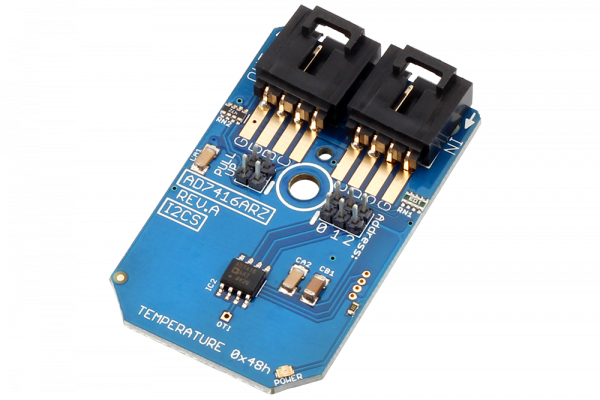

[](https://store.ncd.io/product/ad7416arz-10-bit-temperature-sensor-i2c-mini-module/).

# AD7416ARZ

The AD7416 is 10-bit temperature sensor that can operate from a single 2.7 V to 5.5 V power supply. The AD7416 is a temperature-monitoring-only device in an 8-lead package.
This Device is available from www.ncd.io

[SKU: AD7416ARZ]

(https://store.ncd.io/product/ad7416arz-10-bit-temperature-sensor-i2c-mini-module/)
This Sample code can be used with Raspberry Pi.

Hardware needed to interface AD7416ARZ Temperature Sensor With Raspberry Pi :

1. <a href="https://store.ncd.io/product/ad7416arz-10-bit-temperature-sensor-i2c-mini-module/">AD7416 Temperature Sensor</a>

2.  <a href="https://store.ncd.io/product/i2c-shield-for-raspberry-pi-3-pi2-with-outward-facing-i2c-port-terminates-over-hdmi-port/">Raspberry Pi I2C Shield</a>

3. <a href="https://store.ncd.io/product/i%C2%B2c-cable/">I2C Cable</a>

## Python

Download and install smbus library on Raspberry pi. Steps to install smbus are provided at:

https://pypi.python.org/pypi/smbus-cffi/0.5.1

Download (or git pull) the code in pi. Run the program.

```cpp
$> python AD7416.py
```
The lib is a sample library, you will need to calibrate the sensor according to your application requirement.
